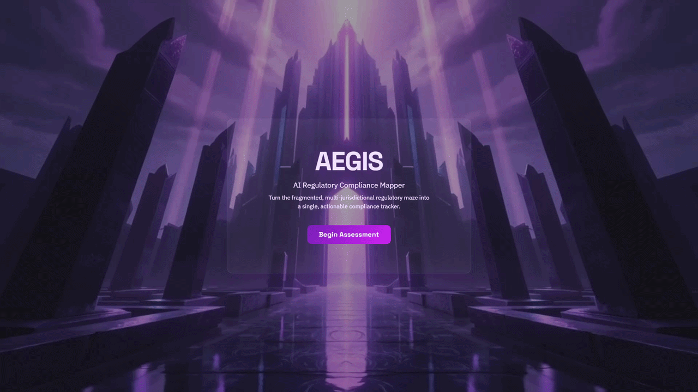

# Aegis

**Live:** [aegis.nfroze.co.uk](https://aegis.nfroze.co.uk)

A client-side AI regulatory compliance mapper that synthesises 70+ obligations across six frameworks into a personalised compliance dashboard  -  replacing the £500/hour consultant with a five-question wizard.

## Overview

Organisations deploying AI in the UK and EU face a patchwork of overlapping regulations: the EU AI Act, UK GDPR, ICO Guidance, NIST AI RMF, OWASP Top 10 for GenAI, and the Equality Act 2010. Understanding which obligations apply  -  and where they overlap  -  typically requires specialist legal counsel at hundreds per hour.

Aegis replaces that with a structured, self-service questionnaire. Five questions about your AI system (type, data sensitivity, geography, sector, decision impact) feed a compliance engine that filters 70+ obligations, clusters cross-framework duplicates using a Union-Find algorithm, and surfaces regulatory gaps. The entire engine runs client-side in the browser with zero API calls, zero backend infrastructure, and hosting costs under £2/month on S3.

The result is a live compliance dashboard showing per-framework coverage percentages, an interactive obligation checklist, and a gap analysis highlighting areas where current regulation falls short  -  like AI liability redress and environmental impact assessment.

## Architecture

Each of the 70+ regulatory obligations declares its own applicability conditions as structured data  -  field, operator, value  -  so the engine evaluates them generically without monolithic filtering logic. Adding a new framework means adding a data file; zero engine code changes.

The compliance pipeline runs five stages: filter applicable obligations, group by framework, detect cross-references via Union-Find clustering (path compression keeps lookups instant, avoids O(n²) pairwise comparison), identify gaps from eight pre-defined risk templates plus essential category coverage, and calculate per-framework completion percentages in real time as users check off obligations.

The results dashboard is code-split via React.lazy and Suspense, keeping the landing page and questionnaire bundle lean. The heaviest components only load when the user reaches results.

## Tech Stack

**Frontend**: React 19, TypeScript, Tailwind CSS v4, Vite 7, Motion (Framer Motion v12), React Router v7

**Design**: Dark glassmorphic theme (Space Grotesk, IBM Plex Sans, JetBrains Mono), animated gradient orbs, scroll-reveal animations

**Infrastructure**: AWS S3 (static hosting, eu-west-2), Cloudflare (DNS, SSL, DDoS), Terraform

**Data**: 6 regulatory frameworks, 70+ obligations with structured applicability conditions, 8 gap analysis templates

## Key Decisions

- **Zero-backend architecture**: All obligations compiled as TypeScript modules at build time. Eliminates runtime costs, API latency, and failure modes. Regulatory updates at legislative timescales make rebuild-on-change entirely acceptable.

- **Declarative obligation model**: Each obligation declares conditions as `{ field, operator, value }` rather than embedding logic. This keeps 70+ obligations across 6 jurisdictions maintainable and extensible without touching engine code.

- **Union-Find for cross-reference clustering**: Obligations that reference each other across frameworks get grouped automatically, so compliance teams don't address the same requirement six times. Path compression keeps union operations instant regardless of dataset growth.

- **Severity-tiered gap analysis**: Gaps are identified at two levels  -  pre-defined templates (environmental impact, liability, decommissioning) and essential category coverage checks  -  giving teams visibility into what current regulation doesn't cover.

## Author

**Noah Frost**

- Website: [noahfrost.co.uk](https://noahfrost.co.uk)
- GitHub: [github.com/nfroze](https://github.com/nfroze)
- LinkedIn: [linkedin.com/in/nfroze](https://linkedin.com/in/nfroze)
